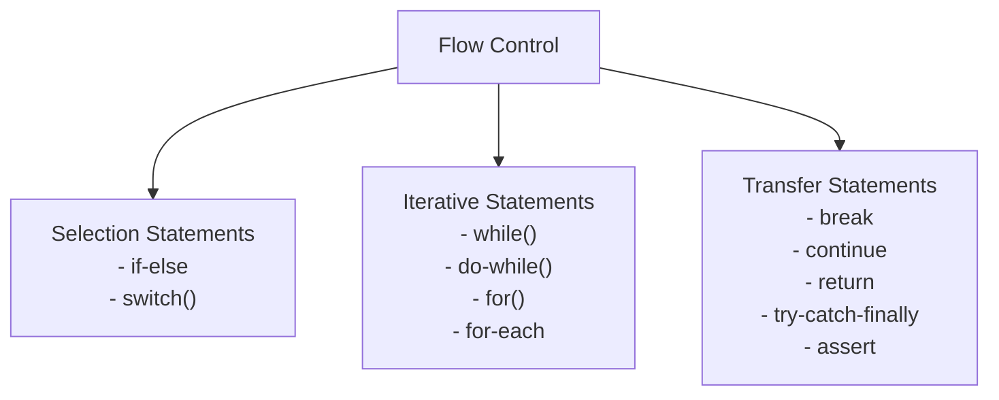

Flow control determines the sequence in which statements are executed during runtime.

```mermaid
flowchart TD
    A[Flow Control] --> B["`Selection Statements
    - if-else
    - switch()`"]
    A --> C["`Iterative Statements
    - while()
    - do-while()
    - for()
    - for-each`"]
    A --> D["`Transfer Statements
    - break
    - continue
    - return
    - try-catch-finally
    - assert`"]
```