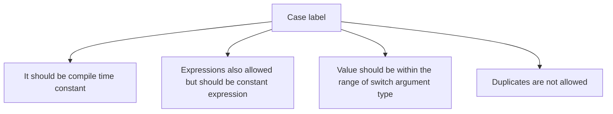

## `if-else` statement

**syntax:**
```java
if (condition) {
  // Code to execute if condition is true
} else {
  // Code to execute if condition is false
}
```
The argument of the `if` statement must be of boolean type. Providing any other type will result in a compile-time error.

```java
//Example
int x = 10;
if (x) { // Compile Error: incompatible types, found: int, required: boolean
  System.out.println("Hello");
} else {
  System.out.println("Hi");    
}
```
In Java, the condition inside an `if` statement must be of boolean type (`true` or `false`). However, in this code, `x` is an integer, which is not automatically converted to a boolean. As a result, this code will cause a **compile-time error**.

The **correct version** of the above code should be:
```java
int x = 10;
if (x != 0) {
  System.out.println("Hello");
} else {
  System.out.println("Hi");
}
```
Now, since `x = 10` (which is not zero), the condition `x != 0` evaluates to `true`, so the output will be:
```text
Hello
```

```java
//Another Example:
boolean b = true;
if(b == false) {
  System.out.println("Hello");
} else {
  System.out.println("Hi")
}

//output: Hello
```

The `else` part and curly braces `{}` are optional. When curly braces are omitted, only a single statement is allowed, and it must not be a declarative statement.

```java
if(true)
    System.out.println("Hello") //output: Hello

if(true); //valid empty statement

if(true)
    int x = 10; //compile time error

if(true) {
  int x = 10; //valid statement
}
```
**Note:** Semicolon (`;`) is a valid statement which is also known as an empty statement.

There is no dangling else problem in Java. Every else is binds to the nearest if statement.

```java
//Example:
int x = 5, y = 10;

if (x > 0)
  if (y < 5)
    System.out.println("Condition met");
  else
    System.out.println("Else block executed");
  
//Output: Else block executed
```

## `switch` statement

When multiple options are available, using nested `if-else` statements is not recommended as it reduces readability. Instead, the `switch` statement should be used for better clarity and structure.

**Syntax:**

```java
switch (expression) {
  case value1:
    // Code to execute if expression matches value1
  break;

  case value2:
  // Code to execute if expression matches value2
  break;

  case value3:
  // Code to execute if expression matches value3
  break;

  // More cases can be added as needed

  default:
  // Code to execute if none of the cases match
```

1. The allowed argument type for switch statement are
```java
//until 1.4 version
byte
short
char
int 
```
But from 1.5v onwards, corresponding wrapper classes and `enum`  type also allowed. <br>
From 1.7v onwards, `String` type also allowed. <br>

2. Curly braces are mandatory in a `switch` statement, but they are optional in all other control structures.

3. Both `case` and `default` are optional, ie an empty `switch` statement is a valid java syntax.
```java
//eg.
switch(expression){
} //valid syntax
```

4. In a `switch` statement, every statement must be placed within a `case` or `default` block; independent statements are not allowed, otherwise, a compile-time error will occur.
```java
//eg.
int x = 10;
switch(x) {
  System.out.println("Hello"); //compile error: case, default, or } expected.
}
```
5. Every case label should be compile time constant (i.e. constant expression)
```java
//eg.
int x = 10;
int y = 20;
switch(x) {
  case 10:
      System.out.println(10);
      break;
  case y:  //CE: constant expression required
      System.out.println(20);
      break;
}
```
If we declare variable `y` as final, then there won't be any compile time error.

6. Switch argument and case label can be expression but case label should be constant expression.
```java
int x = 10;
switch(x+1) {
    case 10:
        System.out.println(10);
        break;
    case 10+20+30:
        System.out.println(60);
        break;
}
```

7. Every case label should be in the range of switch argument type, otherwise compile time error will be raised.
```java
byte b = 10;
switch(b) {
    case 10:
    case 100:
    case 1000:
}
//CE: possible loss of precision, found: int, required: byte

byte b = 10;
switch(b+1) {
    case 10:
    case 100:
    case 1000:
}
//valid code
```

8. Duplicate case labels are not allowed, otherwise compile time error will be raised.
```java
int x  = 10;
switch(x) {
    case 97:
    case 97:
    case 97:
    case 'a': //CE: duplicate case label.
}
```

### Summary



## Fall through inside switch

In a switch statement, when a case matches, all later statements will execute sequentially until a `break` statement is encountered or the switch block ends. This behavior is known as **fall-through** in a switch statement.

```java
switch(x) {
    case 0:
        System.out.println(0);
    case 1:
        System.out.println(1);
        break;
    case 2:
        System.out.println(2);
    default:
        System.out.println("default");
}

//if x = 0, o/p = 0 & 1
//if x = 1, o/p = 1
//if x = 2, o/p = 2, default
//if x = 3, o/p = default
```

### default case
- The default case can appear only once in a switch statement.
- The default case executes only when no other case in the switch statement matches.
- The default case can be placed anywhere within a switch statement, but it is recommended to position it at the end for better readability and maintainability.

```java
switch(x) {
    default:
        System.out.println("default");
    case 0:
        System.out.println(0);
        break;
    case 1:
        System.out.println(1);
    case 2:
        System.out.println(2);
}

//if x = 0, o/p = 0
//if x = 1, o/p = 1, 2
//if x = 2, o/p = 2
//if x = 3, o/p = default, 0
```