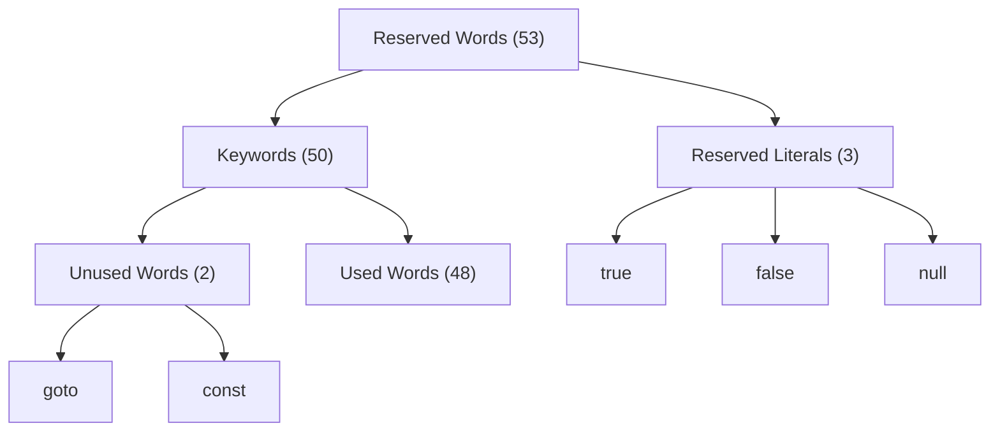

# Java Identifiers and Reserved words

## Java Identifiers

A name in java program is called identifier which can be used for identification purpose.

It can be method name, variable name, class name or label name.

```java linenums="1"
//Example

class Test {
    public static void main(String[] args) {
        int x = 10;
    }
}
```

In this example, there are 5 identifiers

- `Test` - class name
- `main` - method name
- `String` - Pre-defined class name
- `args` - variable name of type String
- `x` - variable name of type int


### Rules for defining Java identifiers

1) The only allowed characters in Java identifiers are

a to z <br>
A to Z <br>
0 to 9 and<br>
$, _ (underscore)

Usage of any other character will result in compilation error.

```java
String total_number; //valid
String total#; //invalid
```

2) Identifiers cannot start with digits
    
```java
String total123; //valid
String 123total; //invalid
```

3) Java identifiers are case-sensitive, and of-course Java language itself is treated as case-sensitive programming language.

```java linenums="1"
class Test {
    int number = 10;
    int Number = 10;
    int NUMBER = 10;
    
    // In this example, all variable names are different, so all are valid
}
```

4) There is no length limit for Java identifier, but it is not recommended to take too lengthy identifiers.

5) We can't use reserved words as identifiers.

```java linenums="1"
int x = 10; //valid
int if = 10; //invalid
```
6) All pre-defined Java class name and interface name can be used as identifiers.

```java linenums="1"
class Test {
    public static void main(String[] args) {
        int String = 888;
        System.out.println(String); //prints 888
        
        int Runnable = 999;
        System.out.println(Runnable); //prints 999
    }
}
```
Even though it's valid, but not good a programming practice. It reduces readability and creates confusion.


Identify valid Java identifiers

```java linenums="1"
String total_number; //valid
String total#; //invalid
String 123total; //invalid
String total123; //valid
String ca$h; //valid
String _$_$_$_; //valid
String all@hands; //invalid
String Java2Share; //valid
String Integer; //valid
String Int; //valid
String int; //invalid
```


## Reserved words

In Java, some words are reserved to represent some meaning or functionality, such type of words are called reserved words.




### Keywords for data types(8)

```java linenums="1"
byte
short
int
long
float
double
boolean 
char
```

### Keywords for flow control (11)

```java linenums="1"
if
else
switch
case
default
while
do
for
break
continue
return
```


### Keywords for modifiers(11)

```java linenums="1"
public
private
protected
static
final
abstract
synchronized
native
strictfp // since 1.2v
transient
volatile
```

### Keywords for Exception handling (6)

```java linenums="1"
try
catch
finally
throws
throw
assert
```

### Class related keywords (6)

```java linenums="1"
class
interface
extends
implements
package
import
```

### Object related keywords (4)

```java linenums="1"
new
instanceof
super
this
```

### void return type keyword(1)
In Java, return type is mandatory. If a method doesn't return anything then we have to declare that method with void return type.

But in C language, return type is optional and default return type is int.


### Unused keywords (2)
```java linenums="1"
goto
const
```

Usage of `goto` keyword created several problem in old language, hence Sun people banned this keyword in Java.

Use `final` instead of `const`.

<strong>Note:</strong> Unused keywords usage in Java will return compile time error.

### Reserved literals (3)

```java linenums="1"
true  // value for boolean data type
false // value for boolean data type
null // default value for object reference.
```

### enum keyword (1.5v)

We can use enum to define a group of named constants.

```java linenums="1"
enum Months {
    JAN, FEB, MAR
}
```


### Conclusion:

- All 53 reserved words in Java contains only lower case alphabet.
- We have only `new` keyword and there is no `delete` keyword, because destruction of useless object is the responsibility of garbage collector.
- Following are new keywords in Java
    
    ```java linenums="1"
    strictfp // 1.2 version onwards
    assert // 1.4 version onwards
    enum // 1.5 version onwards
    ```

- `strictfp` but not `strictFp`
- `instanceof` but not `instanceOf`
- `synchronized` but not `synchronize`
- `extends` but not `extend`
- `implements` but not `implement`
- `import` but not `imports`
- `const` but not `constant`


#### Which of the following list contains only Java reserved words

```java linenums="1"
new, delete //invalid
goto, constant //invalid
break, continue, return, exit //invalid
final, finally, finalize //invalid
throws, throw, thrown //invalid
notify, notifyAll //invalid
implements, extends, imports //invalid
sizeof, instanceof //invalid
instaceOf, strictFp //invalid
byte, short, Int //invalid
```
<br>