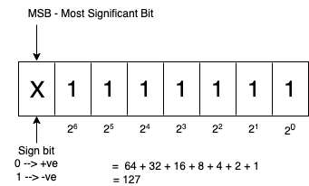

# Data Types

In Java, every variable expression has some type. Every data type is clearly defined.

Compiler should check every assignment for type compatibility. 

Because of the above reason, we can conclude Java language is a strongly typed programming language.

Java is not considered as a pure object-oriented programming language
because several OOPS features are not satisfied by Java
(like operator overloading, multiple inheritance, etc.).
Moreover, we depend on primitive datatypes which are non objects.


## Primitive Data types (8 types)

- Non-Numeric data type (2 types)
    * char
    * boolean

- Numeric data types (6 types)
    - Integral data types
        - byte
        - short
        - int
        - long 
    - Floating point data types
        - float 
        - double

Except boolean and char, remaining data types are considered as signed data types because we can represent both positive and negative numbers.


### byte

**Size**: 1 byte (8 bits)

**MAX_VALUE**: 127

**MIN_VALUE**: -128

**Range**: -128 to 127



The most significant bit act as signed bit. 0 indicate positive number and 1 indicate negative number.

Positive number will be represented directly in memory, whereas negative number will be represented in two's compliment form.

```java linenums="1"
//Examples:

byte b = 10; //valid
byte b = 127; //valid

byte b = 128; 
//Compile time Exception: Possible loss of precision 
//found: int, required: byte

byte b = 10.5; 
//Compile time Exception: Possible loss of precision 
//found: double, required: byte

byte b = true; 
//Compile time Exception: Incompatible types
//found: boolean, required: byte

byte b = "test"; 
//Compile time Exception: Incompatible types
//found: java.lang.String, required: byte
```

byte is the best choice, if we want to handle data in terms of streams, either from the file or from network
(a file or network supported form is byte).


### short 

This is rarely used datatype in Java.

**Size**: 2 bytes (16 bits)

**Range**: -2<sup>15</sup> to 2<sup>15</sup> -1 [-32768 to 32767]

```java
//Example:

short s = 32767; //valid
short s = 32768; //CE: Possible loss of precision, found: int, required: short
```

short datatype is the best suitable for 16-bit processor like 8085,
but these processors are completely outdated and hence the corresponding short datatype is also outdated datatype.

### int

This is the most commonly used datatype in Java.

**Size**: 4 bytes (32 bits)

**Range**: -2<sup>31</sup> to 2<sup>31</sup> - 1  [-2147483648 to 2147483647]

```java linenums="1"
//Example: 

int x = 2147483647; //valid
int x = 2147483648; //CE: integer number too large

int x = 2147483648L; 
//CE: Possible loss of precision, found: long, required: int

int x = true; //CE: incompatible datatype, found: boolean, required: int
```

### long
Sometimes integer may not enough to hold a large value then we can use long datatype.

**Size**: 8 bytes (64 bits)

**Range**: -2<sup>63</sup> to 2<sup>63</sup> - 1

eg.
 
The amount of distance traveled by light in 100 days, to hold this value, `int` may not enough.

`long l = 126000000000;`

The number of characters present in a big file may exceed int range, hence the return type of length method is long but not int.

`long l = file.length();`

**Note**: All above datatypes (byte, short, int, long) meant for representing integral values. 
If we want to represent floating point values, then we should use floating point datatype.

### float
If we want 5 to 6 decimal place of accuracy then we should use `float`. It follows single precision.

**Size**: 4 bytes (32 bits)

**Range**: -3.4e<sup>38</sup> to 3.4e<sup>38</sup>

### double
If we want 14 to 15 decimal place of accuracy then we should use `double` datatype. It follows double precision

**Size**: 8 bytes (64 bits)

**Range**: -1.7e<sup>308</sup> to 1.7e<sup>308</sup>


### boolean

**Size**: Not applicable [virtual machine dependent]

**Range**: Not applicable [but allowed values are true and false]

```java linenums="1"
boolean b = true; //valid
boolean b = 0; // CE: incompatible types, found: int, required: boolean

boolean b = True; 
//CE: cannot find symbol, symbol: variable True, location: class ClassName

boolean b = "true"; 
//CE: incompatible types, found: java.lang.String, required: boolean
```

### char

Old languages (like c/c++) are ASCII based, and the number of allowed ASCII characters is less than or equal to 256.
To represent these 256 characters, 8 bits(1 byte) is enough, hence the size of char in old language is one byte.

But Java is Unicode-based, 
and the number of different Unicode characters is greater than 256 and less than or equal to 65,536.
To represent these many characters, 8 bits may not be enough.
So it uses 16 bits, hence the size of `char` in Java is two bytes.

**Size**: 2 bytes (16 bits)

**Range**: 0 to 65,536

## Summary of Java primitive datatypes

| Data type | Size    | Range                                 | Wrapper class | Default value                  |
|:----------|:--------|:--------------------------------------|:--------------|:-------------------------------|
| byte      | 1 byte  | -2<sup>7</sup> to 2<sup>7</sup> - 1   | Byte          | 0                              |
| short     | 2 bytes | -2<sup>15</sup> to 2<sup>15</sup> - 1 | Short         | 0                              |
| int       | 4 bytes | -2<sup>31</sup> to 2<sup>31</sup> - 1 | Integer       | 0                              |
| long      | 8 bytes | -2<sup>63</sup> to 2<sup>63</sup> - 1 | Long          | 0                              |
| float     | 4 bytes | -3.4e38 to 3.4e38                     | Float         | 0                              |
| double    | 8 bytes | -1.7e308 to 1.7e308                   | Double        | 0                              |
| char      | 2 bytes | 0 to 65,536                           | Character     | 0 [represents space character] |
| boolean   | NA      | NA [allowed values true/false]        | Boolean       | false                          |

<strong>Note:</strong> `null` is default value for object reference, and we can't apply for primitive.
If we try to use for primitive, we'll get compile time error.

```java
//Example
char ch = null; //CE: incompatible types, found: <null type>, required: char
```
<br>