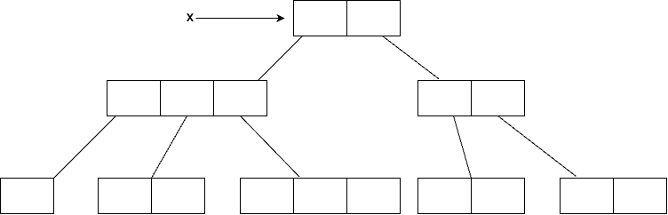

# Arrays

## Introduction
An Array is an indexed collection of fixed number of homogeneous data elements.

The main advantage is, we can represent huge number of values by using single variable so that readability of code will be improved.

But the disadvantage of Arrays is fixed in size, i.e. once we create an array, there is no way of increasing or decreasing the size based on requirement.

In order to use array, we should compulsory know the size in advanced, which may not possible always.

## Array declaration

### One-dimensional

```java linenums="1"
int[] x;
int []x;
int x[];
// all of the above are valid declaration, 
// but recommended is first case because name is clearly separated from type
```
<br>

At the time of declaration, we cannot specify the size, otherwise will get compile time error.
```java linenums="1"
//Example:
int[6] x; //invalid
int[] x; //valid
```

### Two-dimensional
```java linenums="1"
int[][] x;
int [][]x;
int x[][];
int[] []x;
int[] x[];
int []x[];
// all of the above are valid declaration
```
<br>

Which of the following are valid:
```java linenums="1"
int[] a, b;  //valid dimension a=1,b=1
int[] a[], b; //valid dimension a=2,b=1
int[] a[], b[]; //valid dimension a=2,b=2
int[] []a, b;  // valid dimension a=2,b=2
int[] []a, b[]; //valid dimension a=2,b=3
int[] []a, []b; //invalid, compilation error.
```
<br>

If we want to specify dimension before the variable, this facility is applicable only for first variable in declaration. If we try to apply for remaining variable, compile time error will be raised.
```java
int[] []a, []b, []c; //invalid
```

### Three-dimensional

```java
int[][][] a;
int [][][]a;
int a[][][];
int[] [][]a;
int[] []a[];
int[] a[][]
int[][] []a;
int[][] a[];
int [][]a[];
int []a[][];
//all of the above are valid declaration
```

## Array Creation

Every array in java is an object, hence we can create array by using new operator.
```java
int[] a = new int[3];
```

```java linenums="1"
int[] a = new int[3];
System.out.println("class name: " + a.getClass().getName()); 
// class name: [I
```
<br>

For every array type, corresponding classes are available and these classes are part of java language and not available to the programmer level.

<table>
    <tr>
        <th>Array Type</th>
        <th>Corresponding class name</th>
    </tr>
    <tr>
        <td>int[]</td>
        <td>[I</td>
    </tr>
    <tr>
        <td>int[][]</td>
        <td>[[I</td>
    </tr>
    <tr>
        <td>double[]</td>
        <td>[D</td>
    </tr>
    <tr>
        <td>short[]</td>
        <td>[S</td>
    </tr>
    <tr>
        <td>byte[]</td>
        <td>[B</td>
    </tr>
    <tr>
        <td>boolean[]</td>
        <td>[Z</td>
    </tr>
</table>

### Array loopholes

1. At the time of array creation, compulsory we should specify the size otherwise compile time error will be raised.
```java
int[] x = new int[]; //invalid
int[] x = new int[3]; //valid
```

2. It is legal to have an array with size zero.
```java
int[] x = new int[0]; //valid
```

3. If we try to specify negative size then NegativeArraySizeException will be raised at Runtime.
```java
int[] a = new int[-3]; //Runtime Exception: NegativeArraySizeException
```

4. To specify array size, the allowed datatypes are byte, short, char, int. Specifying any other data type will raise compile time error.
```java linenums="1"
int[] x = new int[10]; //valid

int[] x = new int['a']; //valid, size=97

byte b = 20;
int[] x = new int[b]; //valid

short s = 30;
int[] x = new int[s]; //valid

int[] x = new int[10l]; 
//Invalid, CE: Possible loss of precision. Found: long, required: int
```
**Note:** The maximum allowed array size in Java is Integer.MAX_VALUE which is maximum value of int datatype.
```java linenums="1"
int[] x = new int[2147483647]; //valid size

int[] x = new int[2147483648]; // CE: Integer number too large.
```
Even in the first case, we may get runtime exception, if sufficient heap memory not available.

### Two-dimensional

In java, two-dimensional array is not implemented by using matrix style, it follows array of arrays approach for multidimensional array creation.

The main advantage of this approach is improved memory utilization.
```java linenums="1"
int[][] x = new int[2][];
x[0] = new int[2];
x[1] = new int[3];
```


```java linenums="1"
int x[][][] = new int[2][][];
x[0] =  new int[3][0];
x[0][0] = new int[1];
x[0][1] = new int[2];
x[0][2] = new int[3];
x[1] = new int[2][2];
```

<br>

Which of the following array declarations are valid?
```java linenums="1"
int[] a = new int[]; //invalid
int[] a = new int[3]; //valid
int[][] a = new int[][]; //invalid
int[][] a = new int[3][]; //valid
int[][] a = new int[][4]; //invalid
int[][] a = new int[3][4]; //valid
int[][][] a = new int[3][4][5]; //valid
int[][][] a = new int[3][4][]; //valid
int[][][] a = new int[3][][5]; //invalid
int[][][] a = new int[][4][5]; //invalid
```

## Array initialization

Once we create an array, every array element by default initialized with default value.
```java linenums="1"
int[] x = new int[3];
System.out.println(x); //prints [I@abcde
System.out.println(x[0]); //prints 0
```

**Note:** whenever we try to print any reference variable, internally `toString()` method will be invoked, which is implemented by default to return the string in following form

```java
ClassName@hascodeInHexForm
```

```java linenums="1"
int[][] x = new int[2][3];
System.out.println(x); //[[I@abcdef
System.out.println(x[0]); //[I@123456
System.out.println(x[0][0]); //0

int[][] x = new int[2][];
System.out.println(x); //[[I@abcedf
System.out.println(x[0]); //null
System.out.println(x[0][0]); //RE: NullPointerException
```

If we try to perform any operation on null, then runtime exception called `NullPointerException` will be raised.

Once we create an array, every element by default initialized with default values. We can override these default values with our customized values.

```java linenums="1"
int[] x = new int[6];
x[0] = 10;
x[1] = 20;
x[2] = 30;
x[3] = 40;
x[4] = 50;
x[5] = 60;
x[6] = 70; // RE: ArrayIndexOutOfBoundException
x[-6] = 80; //RE: ArrayIndexOutOfBoundException
x[2.5] = 90; //CE: Possible loss of precision, found: double, required: int
```

**Note:** If we are trying to access array element with out-of-range index (either positive or negative int value) then runtime exception `ArrayIndexOutOfBoundsException` will be raised.

## Array declaration, creation and initialization

We can declare, create and initialize an array in a single line (shortcut representation)

```java linenums="1"
int[] x;
x = new int[1];
x[0] = 10;

int[] x = {10};

char[] ch = {'a', 'e', 'i', 'o', 'u'};

String[] s = {"A", "B", "C"};
```
<br>

We can use this shortcut for multidimensional arrays as well.
```java 
int[][] x = {{10,20},{30,40,50}};
```

If we want to use this shortcut, compulsory we should perform all activities in a single line. If we try to divide into multiple lines then will get compile time error.

## length vs length()

length is a final variable applicable for arrays. length variable represents the size of array.

```java linenums="1"
int[] x = new int[6];
System.out.println(x.length()); 
//CE: cannot find symbol. Symbol: method length(), location: class int[]

System.out.println(x.length); //6
```
<br>

length() is final method applicable for String object. length() returns number of characters presents in the String.

```java linenums="1"
String s = "Java";
System.out.println(s.length); 
//CE: cannot find symbol, symbol: variable length
// location class java.lang.String

System.out.println(s.length()); //4
```

**Note:** length variable applicable for Arrays, but not for String objects, whereas length() applicable for String object but not for Arrays.

```java linenums="1"
String[] s = {"A", "AA", "AAA"};
System.out.println(s.length); //3
System.out.println(s.length()); 
//CE: cannot find symbol. symbol: length() method, location class String[]

System.out.println(s[0].length); 
//CE: cannot find symbol. symbol: variable length, 
// location: class java.lang.String

System.out.println(s[0].length()); //1
```

In multidimensional array, length variable represents size of base array but not total size.

```java linenums="1"
int[][] x = new int[6][3];
System.out.println(x.length); //6
System.out.println(x[0].length); //3
```

## Anonymous arrays

Sometimes we can declare an array without name, such type of nameless arrays are called anonymous arrays. 
The main purpose of anonymous arrays is just for instant use (one time usage).

We can create anonymous array as follows
```java
new int[]{10,20,30,40};
```
<br>

While creating anonymous arrays, we can't specify the size, otherwise compile time error will be thrown.
```java
new int[3]{10,20,30}; //invalid
```
<br>

We can create multidimensional anonymous arrays
```java
new int[][] {{10,20},{30,40,50}};
```

Based on our requirement, we can give the name for anonymous array then it is no longer anonymous.

```java
int[] x = new int[]{10,20,30};
```

```java linenums="1"
class Test {
    public static void main(String[] args){
        sum(new int[]{10,20,30});
    }
    public static void sum(int[] x){
        int total = 0;
        for(int x1 : x) {
            int total += x;
        }
        System.out.println("The sum: "+total);
    }
}
```

In the above example, just to call `sum()` we require any array, but after completing `sum()` call, we are not using that array anymore, 
hence for this one time requirement, anonymous array is the best choice.

## Array element assignments

### Case 1:
In case of primitive type array, we can use any type as an array element which can be implicitly promoted to declared type.

```java linenums="1"
int[] x = new int[6];
x[0] = 10; //valid
x[1] = 'a'; //valid

byte b = 20;
x[2] = b; //valid

short s = 30;
x[3] = s; //valid

x[4] = 10l; //CE: Possible loss of precision, found long, required int.
```
In the case of float type array, allowed datatypes are byte, short, char, int, long, float.

### Case 2:
In the case of object type arrays, we can provide either declared type objects or its child class objects as an array element.

```java linenums="1"
//Example 1
Object[] a = new Object[10];
a[0] = new Object(); //valid
a[1] = new String("Java"); //valid
a[2] = enw Integer(10); //valid

//Example 2
Number[] n = new Number[10];
n[0] = new Integer[10]; //valid
n[1] = new Double(10.5); //valid
n[2] = new String("Java"); 
//Invalid, CE: Incompatible types, 
//             found java.lang.String, 
//             required java.lang.Number
```

### Case 3:
For interface type array, array element should be its implementation class objects.

```java linenums="1"
//Example
Runnable[] r = new Runnable[10];
r[0] = new Thread(); //valid
r[1] = new String("Java"); 
//invalid, CE: incompatible type 
//             found: java.lang.String 
//             required: java.lang.Runnable
```
<br>

<table>
    <tr>
        <th>Array Type</th>
        <th>Allowed element type</th>
    </tr>
    <tr>
        <td>Primitive array</td>
        <td>Any type which can be implicitly promoted to declared type</td>
    </tr>
    <tr>
        <td>Object type arrays</td>
        <td>Either declared type or its child class objects</td>
    </tr>
    <tr>
        <td>Abstract class type arrays</td>
        <td>Its child class objects</td>
    </tr>
    <tr>
        <td>interface type arrays</td>
        <td>Its implementation class objects are allowed</td>
    </tr>
</table>

## Array variable assignments

### Case 1:
Element level promotions are not applicable at array level. 
e.g. char element can be promoted to int type whereas char array cannot be promoted to int array.

```java linenums="1"
int[] x = {10, 20};
char[] ch = {'a', 'b'};

int[] b = x; //valid
int[] c = ch; 
//invalid, CE: incompatible types, found: char[], required: int[]
```
<br>

Which of the following promotions will be performed automatically ?
```java linenums="1"
char --> int //yes
char[] --> int[] //no
int --> double //yes
int[] --> double[] //no
float --> int //no 
float[] --> int[] //no 
String --> Object //yes
String[] --> Object[] //yes
```
<br>

In the case of object type arrays, child class type array can be promoted to parent class type array.
```java
String[] s = {"A", "B"};
Object[] o = s; //valid
```

### Case 2:
Whenever we are assigning one array to another array, internal elements won't be copied, just reference variables will be re-assigned.

```java
int[] a = {10, 20};
int[] b = {30};
a = b; //valid
b = a; //valid
```

### Case 3:
Whenever we are assigning one array to another array, the dimension must be matched for example, in the place of one dimension int array, we should provide one dimension array only, failure to do so will result in compile time exception.

```java linenums="1"
int[][] a = new int[3][];
a[0] = new int[4][3]; 
// CE: incompatible types. found: int[][], required: int[] 

a[0] = 10; 
//CE: incompatible types. found: int, required: int[]

a[0] = new int[2]; //valid
```

**Note:** Whenever we are assigning one array to another array, both dimension and types must be matched but sizes are not required to match.

```java
int[][] a = new int[4][3]; //creates 5 objects
a[0] = new int[4]; //creates one object
a[1] = new int[2]; //creates one object

a = new int[3][2]; //creates 4 objects
```
In above program how many objects created in total? --> 11

And how many objects eligible for GC ? --> 7

<br>