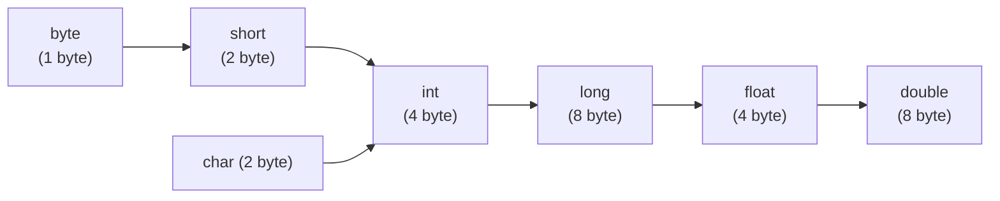

# Arithmetic operators

## Introduction

- The arithmetic operators are (+, -, x, /, %)
- IF we apply any arithmetic operator between two variables a and b, the result type is always `max(int, type of a, type of b)`

```java linenums="1"
byte + byte = int
byte + short = int
short + short = int
byte + long = long
long + double = double
float + long = float
char + char = int
char + double = double
char + double = double

System.out.println('a' + 'b');//195
System.out.println('a' + 0.89); //97.89
```



## Infinity

In integral arithmetic (byte, short, int, long), there is no way to represent infinity, hence if infinity is the result, we will get ArithmeticException in integral arithmetic.

```java
int d = 10/0; //RE: ArithmeticException: / by zero
```

But in floating point arithmetic (float, double), there is a way to represent infinity. For this float and double classes contain the following two constants

```java
POSITIVE_INFINITY
NEGATIVE_INFINITY
```

Hence, even though the result is infinity, we won't get any arithmetic exception in floating point arithmetic.
```java
System.out.println(10/0.0); //Infinity
System.out.println(-10/0.0); //Infinity
```

## NaN (Not a number)

In integral arithmetic, there is no way to represent an undefined result, hence if a result is undefined, we will get runtime exception as ArithmeticException

```java
System.out.println(0/0);  //RE: ArithmeticException: / by zero
```

But in floating point arithmetic, there is a way to represent an undefined result. 
The Float and Double wrapper classes contain NaN constant, hence if the result is undefined, we won't get any ArithmeticException.

```java
System.out.println(0.0/0); //NaN
System.out.println(-0.0/0); //NaN
```
**Note:** For any value of x including NaN, the following expression returns false:
```java linenums="1"
float x = 10.0;
System.out.println(x < Float.NaN); //false
System.out.println(x <= Float.NaN); //false
System.out.println(x > Float.NaN); //false
System.out.println(x >= Float.NaN); //false
System.out.println(x == Float.NaN); //false
System.out.println(Float.NaN == Float.NaN); //false

System.out.println(x != Float.NaN); //true
System.out.println(Float.NaN != Float.NaN); //trues
```

## Arithmetic Exception
- It is a runtime exception but not compile time error.
- It is possible only in integral arithmetic but not in floating point arithmetic.
- The only operators which cause arithmetic exception are `/` and `%`