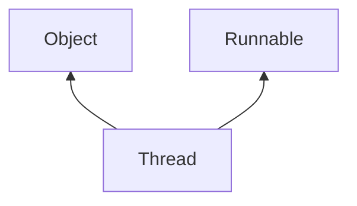

# instanceof operator

We can use `instanceof` operator to check whether given object is of a particular type.

```java linenums="1"
Object o = list.get(0);
if(o instanceof Student) {
  Student s = (Student)o;
  //perform student-specific functionality
} else if(o instanceof Customer) {
  Customer c = (Customer) o;
  //perform customer-specific functionality
}
```

### Syntax
`r instanceof X`, where r is any object reference, X is a class or interface name.

```java
Thread t = new Thread();
System.out.println(t instanceof Thread); //true
System.out.println(t instanceof Object); //true
System.out.println(t instanceof Runnable); //true
```


- To use `instanceof` operator, compulsory there should be some relation between argument types (either child to parent or parent to child or same type), otherwise compile time error will be raised.
  ```java
  Thread t = new Thread();
  System.out.println(t instanceof String);
  //CE: inconvertible types 
  //found: java.lang.Thread 
  //required: java.lang.String
  ```
  
**Note:** For any class or interface X, `null instnaceof X` is always false.