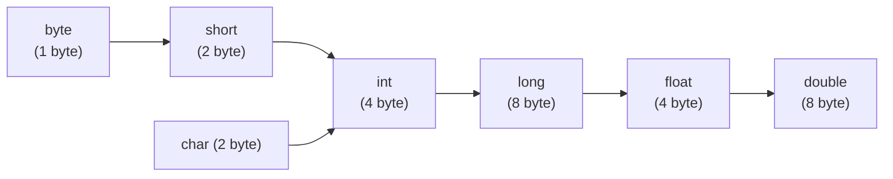
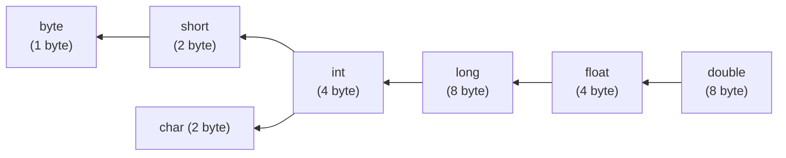

There are two types of type casting

- Implicit type casting
- Explicit type casting

## Implicit type casting
- Compiler is responsible to perform implicit type casting.
- Whenever we are assigning smaller data type value to bigger data type variable, implicit type casting is performed.
- It is also known as widening or upcasting.
- There is no loss of information.

The following are various possible conversions where implicit type casting will be performed.



```java linenums="1"
int x = 'a';
System.out.println(x); //97

double d = 10;
System.out.println(d); //10.0
```

## Explicit type casting

- Programmer is responsible to perform explicit type casting.
- Whenever we are assigning bigger data type value to smaller dat type variable, then explicit type is required.
- It is also known as narrowing or down casting.
- There may be a chance of loss of information.

The following are various possibilities where explicit type casting is required.



```java linenums="1"
int x = 130;
byte b = x;
//CE: possible loss of precision, found:int, required: byte

byte b = (byte) x;
System.out.println(b); //-126
```

- Whenever we are assigning bigger data type value to smaller data type variable by explicit type casting, the most significant bits will be lost. We have to consider the least significant bits.
- If we assign floating point values to integral type by explicit type casting, the digits after the decimal point will be lost.

```java linenums="1"
double d = 130.456;
int a = (int) d;
System.out.println(a); //130

byte b = (byte) d;
System.out.println(b); //-126
```