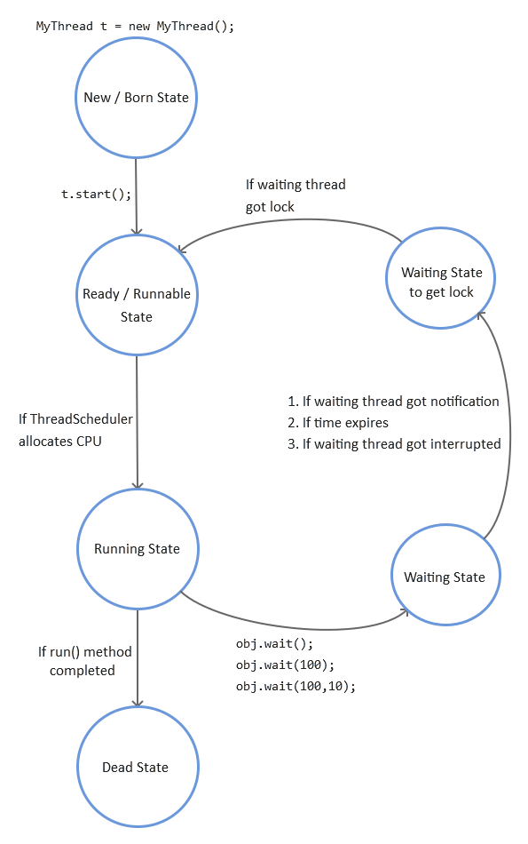

[Back to Threading](../README.md)
# Inter Thread Communication

Two thread will communicate with each other by using `wait()`, `notify()` and `notifyAll()` methods. The thread which requires updation, it has to call `wait()` method. The thread which is responsible to update, it has to call `notify()` method.

`wait()`, `notify()` and `notifyAll()` methods are available in Object class but not in the Thread class. The reason is, threads are required to call these method on any shared object.

If a thread wants to call `wait()`, `notify()` and `notifyAll()` methods, then that thread must be the owner of the object i.e. the thread has to get lock of that object. We can call these methods only from synchronized area, otherwise we will get runtime exception saying `IllegalMonitorStateException`.

If a thread calls `wait()` method, it releases the lock immediately and entered into waiting state. Thread releases the lock of only current object but not all locks. After calling `notify()`, `notifyAll()` methods, thread releases the lock but not immediately. Except `wait()`,`notify()` and `notifyAll()`, there is no other case where thread releases the lock.



### Method signature
1. `public final void wait() throws InterruptedException;`
2. `public final native void wait(long ms) throws InterruptedException;`
3. `public final native void wait(long ms, int ns) throws InterruptedException;`
4. `public final native void notify();`
5. `public final native void notifyAll();`


Example:

```java
class ThreadA extends Thread{
    int total=0;
    @Override
    public void run() {
    	synchronized(this){
            System.out.println("Child thread start notification");
            for(int i =0;i<100;i++){
                total=total+i;
            }
            System.out.println("Child thread trying to give notification");
            this.notify();
    	}
    }
}

public class ThreadB {

    public static void main(String[] args) throws InterruptedException {
        ThreadA a = new ThreadA();
        a.start();

        synchronized (a) {
            System.out.println("main thread trying to call wait()");
            a.wait();
            System.out.println("Main thread got notification");
            System.out.println(a.total);
        }
    }
}
```

In the above example, there are two thread ie main and child thread a. Both threads will start executing simultaneously. If main thread got chance for execution first then it will acquire lock on object 'a' with the help of synchronized block. After acquiring lock `a.wait()` statement will release the lock from object a, and that thread(main) will be entered into waiting state. So that child thread will get chance for its execution, and after executing run block of child thread, it calls `this.notify()` which will notify other thread(main) which is waiting for object a, to start its execution.Once the main thread got notification, it will continue its execution.

If child thread got chance first then child thread will acquire lock on its current object and start executing. At the end of its execution, child thread 'a' is notifying the waiting thread to start its execution and it will release the lock from current object. But there are no thread in waiting state, so the notification will be of no use. Now the main thread will start its execution by acquiring lock on child thread object a. After acquiring lock, it is calling `a.wait()` method, which will release the lock immediately and enter into waiting state. But there are no other thread for execution which will notify main thread, so main thread will wait infinitely. This problem is called producer-consumer problem.


## `notify()` and `notifyAll()`

We can use `notify()` to notify only one waiting thread, but which waiting thread will be notified we cannot predict exactly. All remaining thread has to wait for further notification.

But in case of `notifyAll()`, all waiting threads will be notified, but the threads will be executed one by one.


###Note:

```java
Stack s1 = new Stack();
Stack s2 = new Stack();
...

synchronized(s1){
    s2.wait();
    //This will produce runtime exception IllegalMonitorStateException
    //Since lock is acquired on s1 object and we are trying to call 
    // wait on s2 object.
}

synchronized(s2){
    s2.wait();
    //This will work properly, because we have acquired lock on s2 object.
}
```
