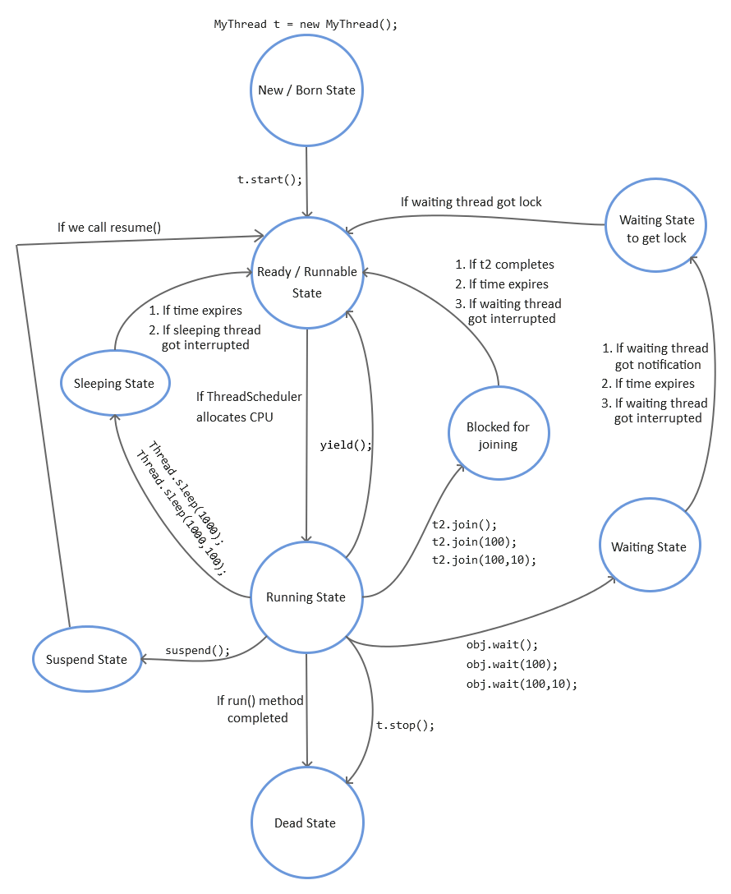

[Back to Threading](../README.md)
# Thread Lifecycle

 

[<-- by implementing Runnable Interface](../2_WaysToCreateThread/ImplementingRunnableInterface.md) &nbsp;&nbsp;&nbsp;&nbsp;|&nbsp;&nbsp;&nbsp;&nbsp; [Next: Getting and Setting Thread name -->](../4_ThreadName/README.md)

 