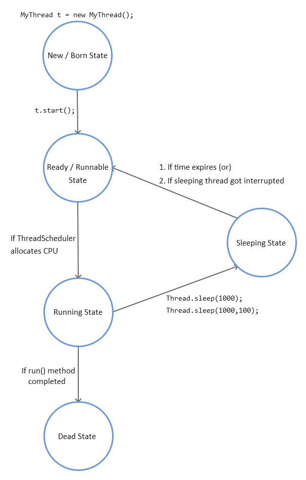

[Back to Threading](../README.md)
# Prevent Thread Execution

## Thread.sleep()

If a thread don't want to perform any operation for a particular amount of time(just pausing) then we should go for `sleep()`.

### Signature of `sleep()` method
1. `public static void sleep(long ms) throws InterruptedException;`
2. `public static void sleep(long ms, int ns) throws InterruptedException;`

Whenever we are using `sleep()` method, compulsary we should handle `InterruptedException` either by using try-catch or throws. Otherwise we will get compile time error.

### Example:
```java
public class SleepExample {

    public static void main(String[] args) throws InterruptedException{
        System.out.println("Welcome to");
        Thread.sleep(2000);
        System.out.println("thinkofjava.io");
    }
}
```
Output:

```
Welcome to
thinkofjava.io
```

In the above output, first line will be printed instantly, and the next line will be printed after 2000milisecond ie 2sec.


## Lifecycle of Thread.sleep();




<div style="float:left">
  <a href="../6_PreventThreadExecution/Thread_join.md" style=""><-- join() </a>
</div>


<div style="float:right">
  <a href="../7_Interruption_of_thread/README.md" style="">Next: Interruption of Thread --> </a>
</div>

<br>