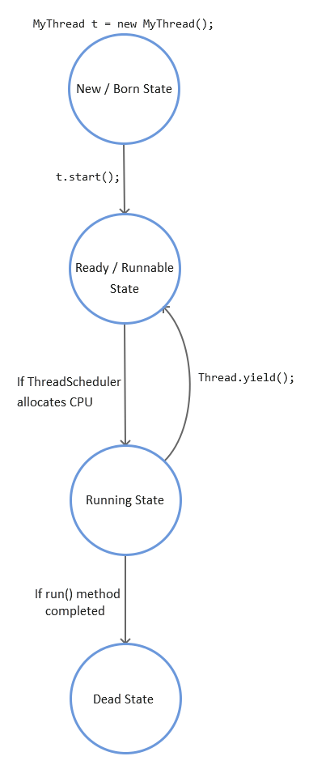

[Back to Threading](../README.md)
# Prevent Thread Execution
## Thread.yield()

Theoretically, to yield means to let go, to give up, to surrender. A yielding thread tells the virtual machine that it's willing to let other threads be scheduled in its place.

yield tells the currently executing thread to give a chance to the thread that have equal priority in the Thread pool.

There is no guarantee that Yield will make the currently executing thread to runnable state immediately

### Signature of `yield()` method
`public static native void yield();`

Example:

```java
class Hey extends Thread{
    public void run() {
        for(int i=0;i<5;i++){
            Thread.yield();
            System.out.println("Hey class "+i);
        }
    }
}
class Hello extends Thread{
    public void run() {
        for(int i=0;i<5;i++){
            Thread.yield();
            System.out.println("Hello class "+i);
        }
    }
}
public class SynchronizedBlock {

    public static void main(String[] args){
        Hey a = new Hey();
        Hello b = new Hello();
        
        a.start();
        b.start();
    }
}
```
If we comment the both `Thread.yield()` line in above example then we might end up getting below output: 

```
Hey class 0
Hey class 1
Hey class 2
Hey class 3
Hey class 4
Hello class 0
Hello class 1
Hello class 2
Hello class 3
Hello class 4
```

If we put `Thread.yield()` then whenever the thread will execute, it will stop and give chance to other thread of same priority.
So we might end up getting below output:

```
Hello class 0
Hey class 0
Hey class 1
Hello class 1
Hey class 2
Hello class 2
Hey class 3
Hello class 3
Hey class 4
Hello class 4
```

## Lifecycle of Thread.yield();

</img>