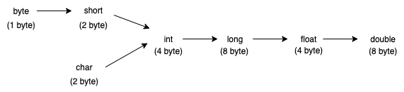

[Back to Language Fundamentals](../README.md)

# Literals

A constant value which can be assigned to a variable is called literal.

```java
//Example

int x = 10;
// int --> datatype/keyword
// x --> name of variable/identifier
// 10 --> constant value/literal
```

## Integral Literal

For integral datatypes (byte, short, int, long) we can specify literal value in following ways:

- Decimal form (base 10)

    Allowed digits are 0 to 9
    
    `int x = 10;`
- Octal form (base 8)

    Allowed digits are 0 to 7. Literal value should be prefixed with 0 [zero]
    
    `int x = 010; //`

- Hexadecimal form (base 16)

    Allowed digits are 0 to 9, a to f. For extra digit (a to f) we can use both lower and upper case character. This is one of very few areas where Java is not case sensitive.
    
    The literal value should be prefixed with `0x` or `0X` [zero x]     

    `int x = 0x10;`
    
    These are only possible ways to specify literal value for integral data type.
    
Q. Which of the following declarations are valid

```java
int x = 10; //valid

int x = 0786; //CE: Integer number too large

int x = 0777; //valid

int x = 0xface; //valid

int x = 0xbeer; //CE: '; expected'

int x = 10, y = 010, z = 0x10;
System.out.println(x+".."+y+".."+z); // 10..8..16

```

By default, every integral literal is of int type, but we can specify explicitly as long type by suffixed with `l` or `L`

```java
int x = 10; //valid
long l = 10L; //valid

int x = 10L; // CE: possible loss of precision, found: long, required: int

long l = 10; // valid
```

There is no direct way to specify byte and short literal explicitly, but indirectly we can specify. Whenever we are assigning integral literal to the byte variable and if the value within the range of byte then compiler treats it as byte literal. Similarly short literals.

```java
byte b = 10; //valid

byte b = 127; //valid

byte b = 128; // CE: possible loss of precision, found: int, required: byte
```

## Floating point literals

By default, every floating point literal is of double type and hence we can't assign directly to float variable. But we can specify floating point literal as float type byt suffixed with `f` or `F`

```java
float f = 123.456; //CE: Possible loss of precision, fount: double, required: float

float f = 123.456f; //valid

double d = 123.456; //valid
```

We can specify explicitly floating point literal as double type by suffixed with `d` or `D`. This convention is not required (or optional).

```java
double d = 123.456d; //valid

float f = 123.456d; //CE: Possible loss of precision, found: double, required: float
```

We can specify floating point literals only in decimal form and we can't specify in octal or hexadecimal forms

```java
double d = 123.456; //valid

double d = 0123.456; //valid, treated as decimal literal

double d = 0x123.456; //CE: Malformed floating point literal
```

We can assign integral literal directly to floating point variables and that integral literal can be specifies either in decimal, octal or hexa decimal forms.

```java
double d = 0777; /valid

double d = 0786; //CE: integer number too large

double d = 0786.0; //valid, treats as decimal integral literal

double d = 10; //valid

double d = 0xFACE; //valid

double d = 0xFACE.0; //invalid
```

We can't assign floating literals to integral type.

```java
double d = 10; //valid

int x = 10.0; //CE: Possible loss of precision, found: double, required: int
```

We can specify floating point literal even in exponential form (scientific notation)

```java
double d = 1.2e3; //valid

float f = 1.2e3; // CE: Possible loss of precision, found: double, required: int
```

## boolean literals

The only allowed values for boolean datatype are `true` and `false`.

```java
boolean b = true; //valid

boolean b = 0; //CE: incompatible types, found:int, required: boolean

boolean b = True; //CE: cannot find symbol, symbol: variable True, location: class ClassName

boolean b = "true"; //CE: incompatible types: found: java.lang.String, required: boolean
```

## char literals

We can specify char literal as single character within single quotes.

```java
char ch = 'a'; //valid

char ch = a; //CE: cannot find symbol, Symbol: variable a, location: class ClassName

char ch = "a"; //CE: incompatible types, found: java.lang.String, required: char

char ch = 'ab'; //CE: unclosed char literal 'ab', not closed statement 'ab'
```

We can specify char literal as integral literal which represents unicode value of character and that integral literal can be specified either in decimal, octal or hexa decimal forms but allowed range is 0 to 65535

```java
char ch = 0xFACE; //valid

char ch = 0777; //valid

char ch = 65535; //valid

char ch = 65536; //CE: possible loss of precision, found: int, required: char
```

We can represent char literal in unicode representation which is nothing but '\uxxxx'

`char ch = '\u0061'; //represents char a`

Every escape character is valid char literal.

```java
char ch = '\n'; //valid

char ch = '\t'; //valid

char ch = '\m'; //CE: illegal escape character
```

<table>
<tr>
  <th>Escape character</th>
  <th>description</th>
</tr>
<tr>
  <td>\n</td>
  <td>New line</td>
</tr>
<tr>
  <td>\t</td>
  <td>Horizontal tab</td>
</tr>
<tr>
  <td>\r</td>
  <td>Carriage return</td>
</tr>
<tr>
  <td>\b</td>
  <td>Backspace</td>
</tr>
<tr>
  <td>\f</td>
  <td>Form feed</td>
</tr>
<tr>
  <td>\'</td>
  <td>Single quote</td>
</tr>
<tr>
  <td>\"</td>
  <td>Double quote</td>
</tr>
<tr>
  <td>\\</td>
  <td>Back slash</td>
</tr>
</table>


Q: Which of the following are valid

```java
char ch = 65536; //invalid

char ch = 0xBEER; //invalid

char ch = \uFACE; //invalid

char ch = '\uBEEF'; //valid

char ch = '\m'; //invalid

char ch = '\iface'; //invalid
```

## String literal

Any sequence of character within double quote is treated as string literal.

`String s = "Java"`


### v1.7 Enhancement with respect to Literals

- Binary literals

    For integral datatype, until 1.6 version we can specify literal values in following ways:
    - decimal form
    - octal form
    - hexadecimal form
    
    But from 1.7v onwards, we can specify literal value even in binary form. Allowed digits are 0 and 1. Literal value should be prefixed with `0b` or `0B` [zero B]
    
    ```java
    int x = 0b1111;
    System.out.println(x); //15
    ```
- Usage of underscore symbol in numeric literals.
    
    From 1.7v onwards, we can use underscore symbol between digits of numeric literal
    
    ```java
    double d = 123456.789;
    double d = 1_23_456.7_8_9;
    double d = 123_456.7_8_9;
    ```
    
    The main advantage of this approach that readability of code will be improved. At the time of compilation, these underscore symbols will be removed automatically. Hence after compilation the above example will become
    
    `double d = 123456.789`
    
    We can use more than one underscore symbol between digits
    
    ```java
    double d = 1__23_4_5__6.00;
    double d = 1___23.4_5;
    ```
    
    We can use underscore symbol only between digits, anywhere else will get compile time error.
    
    ```java
    double d = _12_45.49; //invalid
    
    double d = 12_34_.4_9; //invalid
    
    duble d = 12_34.4_9_; //invalid
    ```



<b>Note:</b> 8 byte long value we can assign to 4 byte float variable because both are following different memory representation internally.

`float f = 10L; //valid`

<Br>
[<-- Back: Datatype](../2_datatype/datatypes.md) &nbsp;&nbsp;&nbsp;&nbsp;|&nbsp;&nbsp;&nbsp;&nbsp; [Next: Arrays -->](../4_arrays/README.md)

<br>